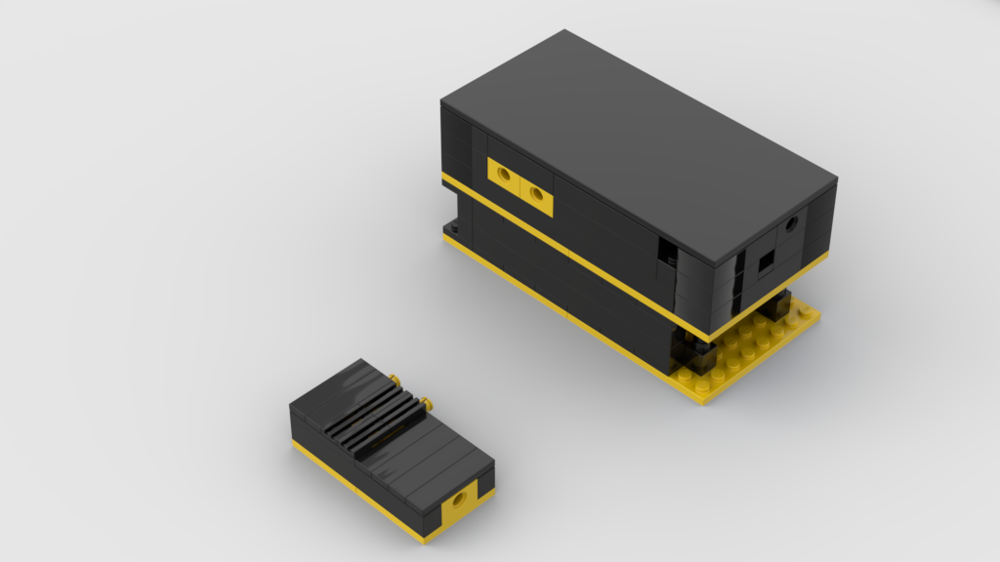

# beehive_monitor_device
A rudimentary device for the environmental monitoring of beehives based on ESP32 board.

## Some details

### 1. The Board
The board used for this project is a standard ESP32-DevKitC [ESPRESSIF Website](https://www.espressif.com/en/products/devkits/esp32-devkitc).
The board has been flashed with MicroPython firmware v1.19.1 [MicroPython](https://micropython.org/download/esp32/)

### 2. The Sensor
The sensor used for this project is a standard DHT22 [Specifications](https://components101.com/sensors/dht22-pinout-specs-datasheet)

### 3. The Software
The software for the measurement and for the BLE connections has been developed using MicroPython for ESP32 [Docs](https://docs.micropython.org/en/latest/esp32/quickref.html)

### 4. The Box
A tailored Lego-based box has been designed for containing the ESP32 board and a PowerBank as power supplier. Further, some peculiarities have been provided for cables and sensor.

The design hass been realized with with Studio by bricklink [Download](https://www.bricklink.com/v3/studio/download.page) and can be downloaded here [Source file](https://github.com/martellux/beehive_monitor_device/blob/develop/box/BoxSmall.io?raw=true)

### 5. How to use it
Once powered, the board starts emitting the BLE advertising packet and it become discoverable and connectable from a BLE client. The name is "swarm-env-sensor".
After the connection, the board shows up the following configuration:

Service | Characteristic
--- | ---
"Environmental Sensing" service with UUID 181A | "Digital" characteristic with UUID 2A56
| "Digital Output" characteristic with UUID 2A57

License
-------

    Copyright 2023 Alessandro Martellucci

    Licensed under the Apache License, Version 2.0 (the "License");
    you may not use this file except in compliance with the License.
    You may obtain a copy of the License at

       http://www.apache.org/licenses/LICENSE-2.0

    Unless required by applicable law or agreed to in writing, software
    distributed under the License is distributed on an "AS IS" BASIS,
    WITHOUT WARRANTIES OR CONDITIONS OF ANY KIND, either express or implied.
    See the License for the specific language governing permissions and
    limitations under the License.

[1]: https://search.maven.org/remote_content?g=com.martellux&a=lifecycle&v=LATEST